以下の案内で解決しない場合は，[サポート窓口](/support)へご相談ください

## 全般

### Q. コース名でコース検索すると，同じコース名のものが複数表示される [共通]
UTOL では，学務システム（UTAS）で登録されている授業コードをもとにコース登録を行います.そのため，学務システム上で履修対象者が異なるなどの理由により，同一曜日・時限の講義であっても複数の「授業コード」が割り当てられている講義の場合には,UTOL 上ではそれぞれ別の講義として登録されます．
- 教員の方へ 
複数コースをまとめて管理したい場合は,コースグループメニューにある「コースグループ登録」機能をご利用ください.複数コースをまとめて管理することができます（コース名が異なる複数コースをグループ化することも可能です）.

- 学生の方へ 
  学務システムで,履修登録している（または,しようとしている）講義の授業コードとコースTOP画面に表示されている時間割コードが一致しているか確認してください．

### Q. 過去の時間割（出講表）を確認したい [共通]
時間割画面上に表示されている年度，開講区分を指定するプルダウンを変更することで，過去の時間割 (または出講表) に変更することができます．

### Q. 機能追加などの要望を伝えたい [共通]
機能追加などの要望については，[サポート窓口](/support)までお知らせください．

なお，お知らせ頂いた要望などについては，多数の利用者が必要とする機能，利便性の向上，改修に要する費用・期間 (時間) など，総合的に判断した上で対応を決定します．そのため,お知らせ頂いた要望などについては,対応できない場合があることをご了承ください．

### Q. UTOL上で表示されている氏名情報を変更したい [共通]
学生・教職員の氏名情報，学務システム（UTAS）上の情報を元に表示しております．また,（UTASを利用していない）職員については,人事情報システムの情報を元に表示しております.

UTASを利用している学生・教職員については，所属部局の教務担当（UTASを利用していない職員については，所属部局の人事担当）にご相談ください．

### Q. メールアドレスやSlack宛に届くUTOLからの通知の言語を変更したい [共通]
個人設定（Persol Setting）画面で，言語設定（日本語 or 英語）を変更してください．なお，通知の具体的な内容については，担当教員が登録したものがそのまま表示されます．

### Q. 表示されている学生証番号が異なる [共通]
本学では，複数の学部や大学院研究科に所属し，かつそれぞれで異なる学生証番号が割り当てられている学生が,少数ながら在籍しています.

しかし,UTOL に登録可能な学生証番号は共通ID (UTokyo Account のユーザ名) に対して1個のみのため,必ずしも UTAS 上の表示とは一致しません． また,それらの複数の組織に所属する間,UTOL 上で表示される学生証番号は,随時切替る場合があります．

### Q. 英語氏名が表示されない [共通]
UTOL上の英語氏名は，学務システム（UTAS）上の情報を元に表示しております．そのため，（UTASを利用していない）職員の英語氏名は表示されません．UTASを利用している方は，英語氏名が正しく登録されているか所属の教務担当にお問い合わせください．

### Q. 学務システム（UTAS）で履修（お気に入り）登録・解除した情報は，いつ反映されますか？ [学生]
UTOL では学務システム（UTAS）に登録済の講義情報や履修者情報について，以下の条件によって自動で登録されます．
- 履修登録期間中に学務システム（UTAS）で履修登録（またはお気に入り登録）が行った場合，UTOLに情報が連携され自動登録されるのは **翌日以降** となります．

- 各コースに履修者情報が自動登録される期間は,コースがUTOLに登録されてから授業期間終了までとなります．

- 選択科目等の学生自身ではなく各部局教務担当がUTASに履修登録を行う場合，UTOL にいつ反映されるか（UTASにいつ登録されるか）は所属の教務担当にお問い合わせください．

### Q. コースグループ登録（グルーピング）に失敗するため，解決方法を知りたい． [教職員]
- コースグループ登録で，まとめて管理したい担当する複数のコース（すでにグルーピングされたコースも含む）を1つのコースにグルーピングすることにより，複数のコースに対して同じコンテンツ（教材や課題，テスト等）をアップロードする必要がなくなります．（複数のコースのうち，いずれかを「親コース」その他のコースを「子コース」と決めることにより，親コースに設定したコースにコンテンツをアップロードすると，子コースとして設定したコースにも同じものが表示されます．）

- 担当教員の画面では，親コース上で子コースを含めたすべての履修者の情報を確認できるようになります．（グルーピングを行うと，担当教員は子コースにはアクセスできなくなり，親コースの画面が表示されます．）

- **親コースおよび子コースが以下の状態の場合，エラーが表示されグルーピングすることができません．**
  - **子コースにコンテンツが存在する**
  - **親コースと同一の履修者が子コースに登録されている（親コースと子コースで履修者が重複している）**

（参考）グルーピング手順
1. グルーピングしたいコース（親コース）のコースTOP画面にアクセスする
1.  ＜左メニュー＞内に表示されている[コースグループ登録]をクリック 
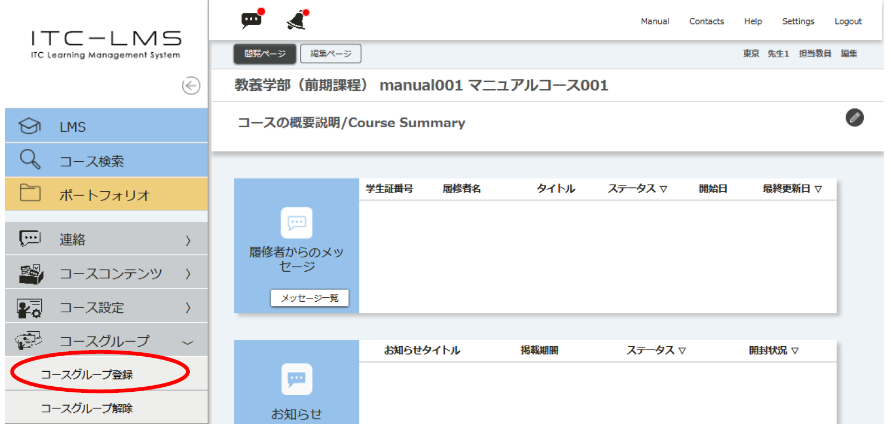
1. コースにグルーピング（登録）するコース（子コース）をチェックボックスで選択し，[確認画面に進む]をクリック
1. 内容確認画面にて，コースグループ設定が問題なければ[登録する]をクリック 
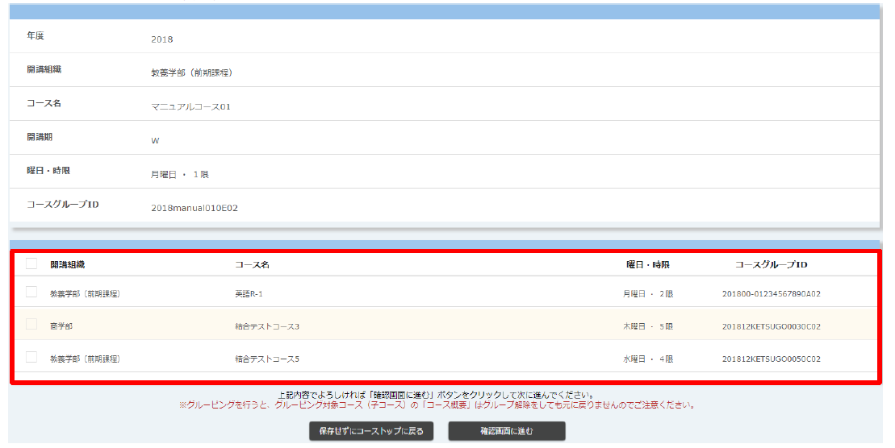

#### エラー発生（子コースにコンテンツが存在する場合）時の対応方法
以下のエラーメッセージが表示され、コースグループ登録（グルーピング）に失敗します。
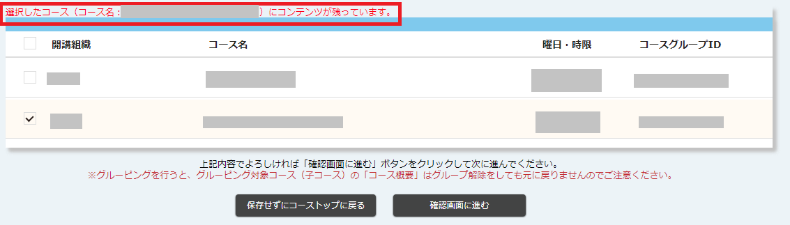
- （すべての）子コース内にコンテンツ（履修者からのメッセージも含む）が登録されていないか確認してください．

- コンテンツが登録されている子コースについて，その子コースのコースTOP画面から全コンテンツ削除機能を利用してコンテンツをすべて削除してください．（親コースはコンテンツを削除する必要はありません．） 
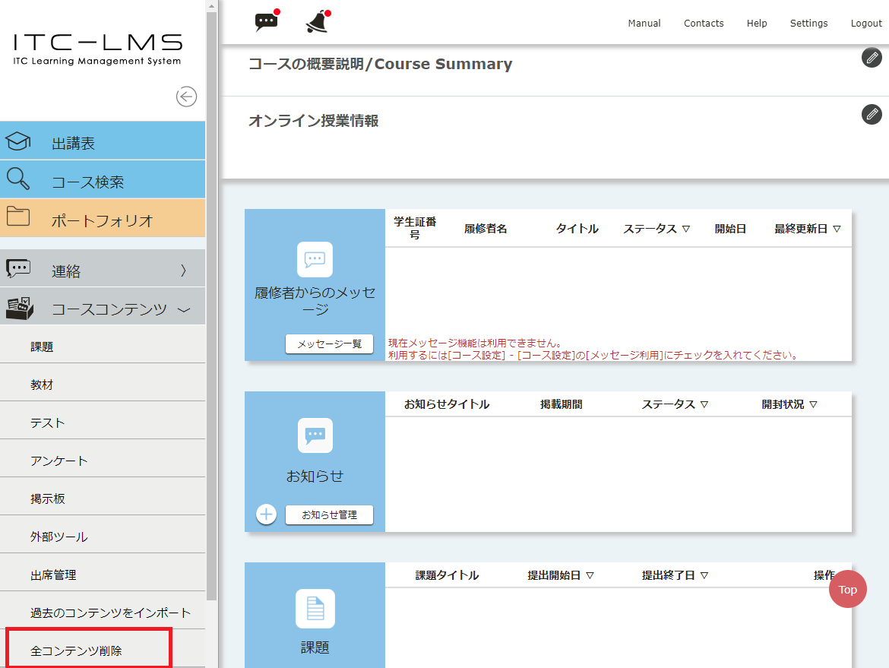

#### エラー発生（親コースと子コースで履修者が重複している場合）時の対応方法
以下のエラーメッセージが表示され、コースグループ登録（グルーピング）に失敗します。
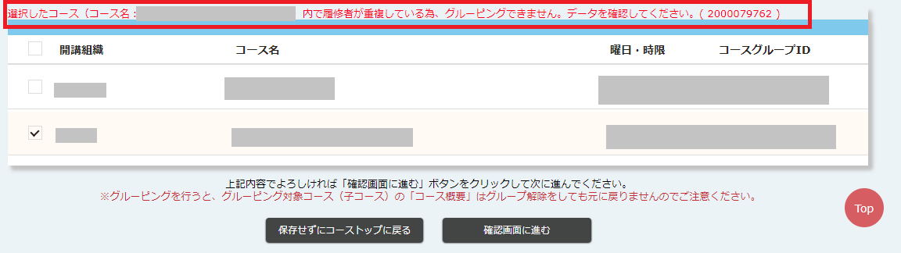
- 各コースのコース参加者一覧画面から親コースと（すべての）子コースの履修者が重複していないか確認してください．

- 履修者が多い場合は，コース参加者一覧画面から履修者名簿（Excelファイル）をダウンロードして確認できます．

- 重複している履修者について，親コースまたは子コースのどちらか片方のコースから削除してください． 
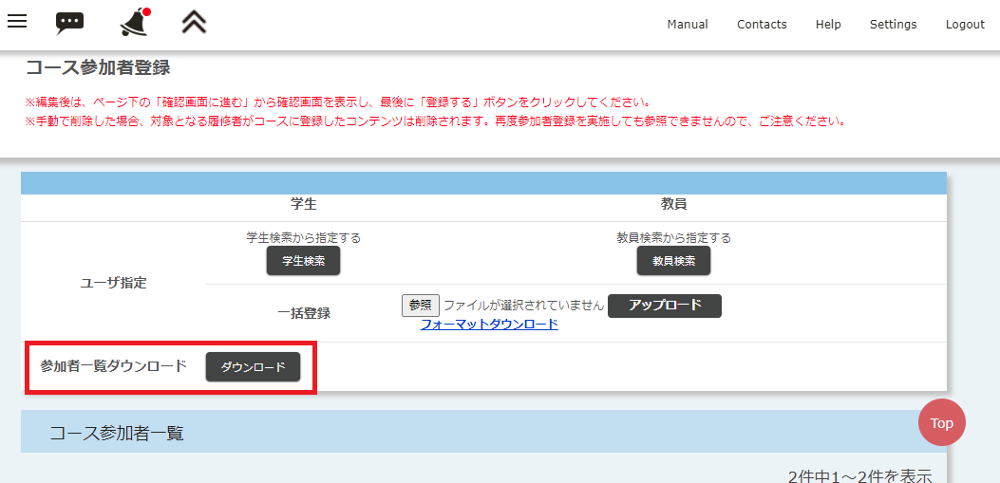

#### 注意点
- 重複している履修者については,基本的に本登録となっていない（お気に入り登録や自己登録となっている）コースの方を削除してください.

- コースから履修者を削除すると,そのコースの課題に提出した成果物やテストの回答も一緒に削除されます.重複する履修者が,本登録となっていないコースに対して課題の成果物を提出済またはテストを回答済の場合,本登録となっているコースからの削除を検討してください.

- 本登録の方のコースから履修者を削除した場合は,削除した当日中にコースグループ登録（グルーピング）を実施してください.（翌日になると削除した履修者の履修登録情報が再びUTASから連携され本登録されてしまいます.）

- コースグループ登録時に履修者が本登録となっていなくても,翌日以降に（グルーピングしたコースに対する）UTASでの履修登録の情報が連携されると,履修登録したコースに対する本登録に自動変更されます.

### Q. 学生がコース内で行った操作の記録を確認したい [教職員]
自分自身が「コース管理者」（担当教員）として登録されているコースにおけるログは,UTOL 上の「システムログ検索」画面から参照できます. 
「システムログ検索」画面を表示するためには,コースのトップページから, 「左メニュー（≡）」→「その他」→「操作ログ参照」 と移動してください.

※操作ログ画面の画面キャプチャ※

検索条件等の詳細については,教員マニュアル「操作ログ参照」をご参照ください．

### Q. 出講表に自分が担当教員となっているコースが表示されない [教職員]
UTOL では学務システム（UTAS）で登録されている講義や履修情報については自動登録されますが,以下の点にご注意ください.
- まずは，UTAS上で正しくご自身が講義の担当教員として登録されているか所属の教務担当にご確認ください．
- UTAS上で講義の担当教員と登録された場合，UTOLに情報が連携され自動登録されるのは **翌日以降** となります．UTASに担当教員として登録された当日の場合は，翌日以降に出講表にコースが表示されているかご確認ください．
- 上記でも解決しない場合は，調査しますので[サポート窓口](/support/index.md)からお問い合わせください.  

### Q. UTASで講義情報（開講曜限・担当教員）を変更したが，コースに変更した情報が反映されていない [教職員]
学務システム（UTAS）の講義情報や履修情報については,毎日夜間に実行されるバッチ処理を通してUTOLに情報が連携されます．
UTASで講義情報を変更しても当日中には連携されないため,翌日以降にUTOLに変更した内容が反映されているか確認してください. 

なお,UTOLに変更後の情報が連携されても変更前の情報は自動削除されません. 
変更前の情報を削除したい場合，こちらの[FAQ](/utol/faq/index.md#q-utasで講義情報開講曜限・担当教員を変更したがコースに変更した情報が反映されていない-教職員)をご確認ください．

### Q. 進学手続きや卒業論文の提出先など授業以外の用途でUTOLのコースを利用したい [教職員]
本学における教育・研究に関連する目的であれば,UTOLのコースを利用いただけます.
学務システム (UTAS) から自動登録される講義（コース）以外において,新規のコース作成をご希望の場合は[申請フォーム](/utol/index.md#申請フォーム)から申請してください.

### Q. 担当教員の代わりに，コース設定の確認や受講者・教材・課題などの登録を行いたい [教職員]
UTOLのコース設定の確認や受講者・教材・課題などの登録を行うためには各コースに対して担当教員権限またはコース設計者権限が必要となります.
担当教員（すでに担当教員権限を持っているユーザ）であれば,教員に限らず職員（や学生に）対しても担当教員権限およびコース設計者権限を付与することができます.

### Q. UTASで講義情報（開講曜限・担当教員）を変更したが，コースに変更前の情報が残っている [教職員]
UTOL では,学務システム(UTAS)から連携されてくる登録情報を基にコース登録を行いますが,一度登録されているコースについては情報の自動削除を行いません.

曜日・時限,担当教員が変更された場合には変更前の曜日・時限,担当教員情報も残ります.
古い情報の削除・訂正は,システム管理者が行う必要がありますので,UTOL担当（lms-support [at mark] itc.u-tokyo.ac.jp）まで対象のコースや変更前後の情報を記載の上ご連絡ください. 
※業務の効率化のため,修正が必要なコースを可能な限りまとめた上依頼をお願いします.

### Q. UTASで複数看板科目の設定を行ったが，グルーピングがされていない [教職員]
UTOL では,学務システム (UTAS) で登録済みの講義については自動でコース登録されますが,コース登録時期は,開講の約 1 ヶ月前になります. 
UTOL 上でコースが自動登録される＜前＞に,学務システム（UTAS）上で適切に設定された複数看板科目については自動的にグルーピングされます.しかし，すでにUTOLにコースが自動登録された＜後＞に,UTASで複数看板科目設定を行った場合はグルーピングはされませんのでご注意ください.

すでにUTOL上で作成されているコースに対してグルーピングを行いたい場合は,コースの担当教員がUTOLの画面上から操作を行ってください.
具体的な操作手順については,教員マニュアル「XXX コースグループ登録」をご参照ください.

### Q. UTASに講義情報を登録したが，コースが作成されていない． [教職員]
UTOL では学務システム（UTAS）で登録されている講義や履修情報については自動登録されますが,以下の場合はUTOLにコースが作成されません.
- UTASに講義情報を登録した当日の場合
  - UTASの講義情報や履修情報については,毎日夜間に実行されるバッチ処理を通してUTOLに連携されています.UTASで講義情報を登録しても当日中には連携されないため,翌日以降にUTOLにコースが作成されているか確認してください.

- 義の開講期設定（講義開始日）が現時点より１ヶ月以上先の場合
  - UTOLへのコース登録時期は,開講の約 1 ヶ月前になります. 
※例えば S1 ターム (や S セメスタ) に開講するコースは 3 月上旬ごろに UTOL へのコース登録が行われます.

- 講義の担当教員の情報として正しい設定がされていない場合
  - UTASで設定した講義の担当教員として, 共通ID（UTokyo Accountの数値10桁）以外が設定されている場合,UTOLに講義情報が連携されてもUTOL上でデータが作られません. 
  UTASでのみ使われるID（「各教員」「卒論指導教員」など教員個人を指定していないもの）を担当教員として設定している場合,該当する担当教員の共通IDを人数分正しく登録し直してください.

## コース参加登録・解除

### Q. TAはコースの履修者として参加登録できますか [共通]
TAとして登録された学生を履修者として登録することで,TAと履修者の権限を持つ （TA兼履修者） 権限で登録出来ます.

### Q. コースの受講登録を解除できない [学生]
学生自身で受講解除できるコースでは,「コース TOP」画面に表示されている「受講登録解除」ボタンから受講解除を行ってください.

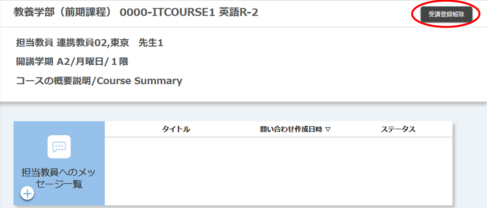

学務システム（UTAS）にて講義を登録（履修登録・お気に入り登録）をしている場合,UTOL上のコースを受講登録解除することはできません.
まず学務システムでの登録を解除し,翌日以降にUTOL上の「コース TOP」画面に「受講登録解除」ボタンが表示されているか確認してください.

また,学務システム（UTAS）にて履修登録・お気に入り登録をしていない場合においても,以下のいずれかに該当する場合,履修者である学生からはコースの受講解除ができません.
担当教員に状況を確認いただき，コース参加者からの削除を依頼してください.

- **コース設定として（途中から）「自己登録」の設定が「不許可」に変更された場合**
  - 学生自身で一度コースを自己登録した後に受講登録解除を行う場合,登録解除時にコース設定として「自己登録」が「許可」となっている必要があります. 
  担当教員に，コース設定として「自己登録」を許可に変更してもらうか，個別にコース参加者からの削除を依頼してください.

- **担当教員によってコース参加者登録されている場合**
  - 担当教員によってコース参加者登録がされている場合,学生からはコースの受講登録解除ができません.担当教員に，個別にコース参加者からの削除を依頼してください.

### Q. 学務システム（UTAS）で履修登録やお気に入りを解除した場合，コースの受講登録解除を行う必要はありますか [学生]
UTASで履修登録やお気に入りを解除した場合，翌日以降に対応するUTOL上のコースに情報が連携され，自動的に受講登録解除されます．（学生自身での受講登録解除の対応は不要です．）

自動的にコースが受講登録解除できない場合は，コースの登録状況について担当教員にご確認ください．
なお,UTOL上のコース受講登録状況が,UTAS上で管理する履修登録の内容に影響を与えることはありません.

### Q. コースの受講登録をしたが，学務システム（UTAS）でも履修登録する必要はありますか [学生]
UTOL で受講登録（コース参加者登録）をしても,学務システム（UTAS）での履修登録処理は行われません.**必ず,学務システム上で履修登録を行って下さい.**

### Q. 学務システム（UTAS）で履修登録していない授業が時間割に表示されている [学生]
正式に履修登録していない講義であっても,担当教員や教職員の都合によって，コースに受講登録している場合があります.詳細について確認されたい場合は，所属の教務担当にお問い合わせください．

### Q. （履修者ではなく）TAとしてコースにアクセスすることはできますか [学生]
可能です．学生自身から「TA」としてコースに登録することはできませんので，コース管理者である担当教員に登録を依頼してください．

### Q. 受講登録したコースにアクセスできなくなった [学生]
コースを担当する教員は「履修者範囲」としてコース内のコンテンツの利用を許可する範囲を設定できます.
デフォルト設定では,履修確定日を過ぎると履修者範囲が自動的に変更され，履修登録をしていない学生はコースにアクセスできなくなります．

学務システム（UTAS）での履修登録をした場合は，翌日以降にUTOLに情報が連携され，再度コースにアクセスすることができます．
履修登録せずに聴講者としてコースに参加したい場合は，[こちらのFAQ](/utol/faq/index.md#q-履修登録せずに聴講者としてコースに参加したい-学生)をご確認ください．

### Q. 履修登録せずに（聴講者として）コースに参加したい [学生]

各コースでは，コース内のコンテンツの利用を許可する範囲（履修者範囲設定）を設定できますが，デフォルト設定では,履修確定日を過ぎるとコース内のコンテンツを利用できるのは履修登録者または担当教員によって個別に登録されたユーザのみとなります．

そのため，担当教員が履修者範囲設定を『本登録・管理者登録のみ』に変更した場合や履修確定日を過ぎた場合などは，コースを自己登録しているユーザはコースにアクセスできなくなります．

聴講者としてコースに参加したい場合は，担当教員に新たに管理者登録していただくよう直接ご依頼してください．
詳細は，[こちらのFAQ](/utol/faq/index.md#q-履修登録せずに聴講する学生に対してコースへの参加を許可したい-教職員)をご確認ください．

### Q. コースへの参加を履修登録者だけに制限したい [教職員]
コースを担当する教員は「履修者範囲」としてコース内のコンテンツの利用を許可する範囲を設定できます．
履修者範囲のデフォルト設定は「履修確定日に『登録方法によらず全て』から『本登録・管理者登録のみ』に自動切替」となります．

履修確定日よりも前からコースへの参加を履修登録者だけに制限したい場合，履修者範囲の設定を『本登録・管理者登録のみ』に変更してください．

※メモ：履修者範囲設定の各項目名については変更となる可能性あり

### Q. 履修登録せずに聴講する学生に対してコースへの参加を許可したい [教職員]
コースを担当する教員は「履修者範囲」としてコース内のコンテンツの利用を許可する範囲を設定できます.
デフォルト設定では,履修確定日を過ぎるとコース内のコンテンツを利用できるのは履修登録者または担当教員によって個別に登録されたユーザのみとなります．

聴講者としてコースに参加したい場合は，一度対象となっている学生を削除していただき，新たに手動でコースに学生を登録してください．
なお，履修者範囲を『登録方法によらず全て』に変更していただければ，（履修登録者以外の）コースに参加しているすべての学生が再度コースにアクセスできます．

### Q. 学生・教職員をコースの参加者として追加したい [教職員]
コース参加者の追加方法は以下の通りです.

担当教員・コース設計者権限で履修者の他に,担当教員やTAも追加することができます.
なお,職員を追加したい場合は,教員の追加方法と同じように「教員検索」から対象のユーザを指定してください.

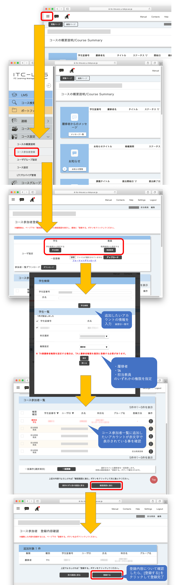

詳しくは,教員向けマニュアルの「XXXX」をご参照ください．

### Q. 参加者として登録されている学生・教職員をコースから削除したい [教職員]
コース参加者・コース設計者の削除方法は以下の通りです.
担当教員権限で履修者の他に,担当教員やTAも削除することができます.

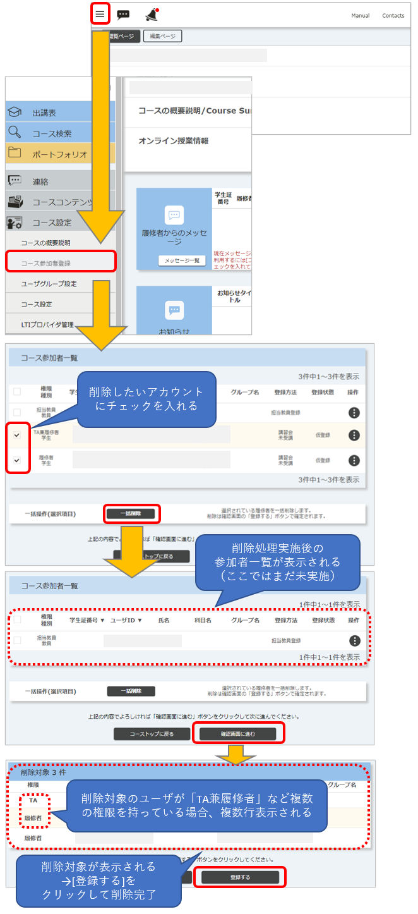

詳しくは,教員向けマニュアルの「XXXX」をご参照ください．

### Q. 学生自身によるコースの受講登録（自己登録）を不許可としたい [教職員]
自己登録の設定は許可が初期値となっていますが,その設定（許可/不許可）は担当教員が随時変更可能です.自己登録を許可している期間では,学生 (履修者) が,自由にコース参加登録や,登録解除を行うことができます.

ただし,自己登録を不許可とした時点で,学生 (履修者) は,自由にコース参加登録や登録解除を行うことはできなくなります.自己登録を不許可としている場合でも,担当教員やコース設計者は随時コース参加者 (履修者,TA) を登録できます.

### Q. コースに登録している参加者一覧がほしい [教職員]
出講表画面で表示されているコース名に「履修者名簿アイコン (顔アイコン)」があります.「履修者名簿アイコン」をクリックすると,履修者名簿を Excel (.xlsx 形式) でダウンロードすることができます．

## お知らせ・教材・テスト・課題・アンケート・掲示板

### Q. アップロードできるファイル容量の上限値を知りたい [共通]
教材資料や成果物などのアップロードするファイルの上限値は 100MB までです.

### Q. 掲示板に匿名で書き込みを行いたい [共通]
匿名での書き込みは出来ません.

### Q. 掲示板の書き込みした内容を修正・削除したい [共通]
学生は自分で記載した発言は削除できます. 他の履修者の発言を削除して欲しい場合は，コース管理者である担当教員に連絡してください.

教員はコース管理者ですので発言の修正・削除が可能です.誹謗中傷や不適切な発言があった場合は削除してください.

### Q. 期限がXX日0時0分と設定されている場合，いつまでに提出・回答すればよいですか [学生]
課題の提出期限が xx 日 00 時 00 分までと指定されていた場合，前日 (xx 日 - 1 日) の 23 時 59 分 59 秒までの提出が「期限内提出」となります.（テストやアンケートも同様に，前日 (xx 日 - 1 日) の 23 時 59 分 59 秒まで回答が可能となります．）

期限直前は，システムの負荷が大きくなる可能性があるため，トラブルを避けるためにも余裕をもって提出・回答してください．

### Q. 課題の成果物（レポート等）が提出出来ないため，解決方法を知りたい [学生]
以下の場合に提出できないことがありますので，該当する項目がないかご確認ください．

- ファイルのサイズが100MB以上
- ファイルがウイルスに感染している
- ファイルのアップロード時にコンピュータウィルスに感染していないかを確認しています.
- ファイル名に絵文字や禁止文字が含まれている

＜禁止文字＞
\\ , / , : , * , ?, < , > , | , \ , % , # , ` , { , } , ^ , [ , ] ,~

### Q. 提出した成果物（レポート等）が削除できない [学生]
学生が提出した課題のファイルに対して,教員が評価・コメントを行った場合,その後学生は自分が提出したファイルを削除できません.

ファイルを再提出する場合は,名前を変更したファイルをアップロードするか,担当教員にファイルを削除いただくよう依頼してください.

### Q. 教材として大容量（100MB以上）の動画をアップロードしたい [教職員]
UTOLの教材機能では, 動画ファイルや各種動画サイトのURLを設定することで, 動画教材を配布及び配信することが可能です.
ただし, ファイルをアップロードする場合, UTOLは各コンテンツに容量制限があり, 教材ファイルは100MBとなっております. そのため, 100MBを超えるファイルはアップロードできません.

本FAQでは，ECCSクラウドメールにおけるドライブ (Drive) (drive.google.com)を利用して, 100MBを超える動画ファイルをUTOLから閲覧可能にする方法, 及びYoutubeに「限定公開」としてアップロードした動画をUTOLから閲覧可能にする方法をご説明します.

- Googleドライブで公開
  - メリット
    - ECCSクラウドメールのアカウントを持っている人のみが視聴可能
  - デメリット
    - 大量の履修者が同時に視聴すると, 視聴できなくなる可能性がある
- Youtubeで限定公開
    - メリット
      -  ECCSクラウドメールのアカウントを持っている人のみが視聴可能
  - デメリット
    - 大量の履修者が同時に視聴すると, 視聴できなくなる可能性がある

#### Googleドライブで公開する手順
1. ご自身のECCSクラウドメールのアカウントとパスワードを入力し, ECCSクラウドメールにログインします.
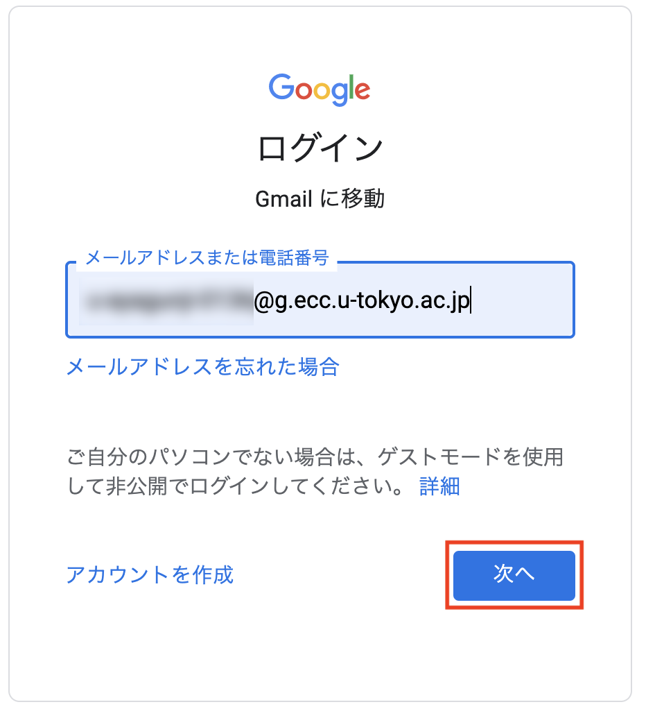
1. ログイン後, 画面右上の「9個の丸が書いてある」アイコンをクリックし, 表示された中から「ドライブ」をクリックします.
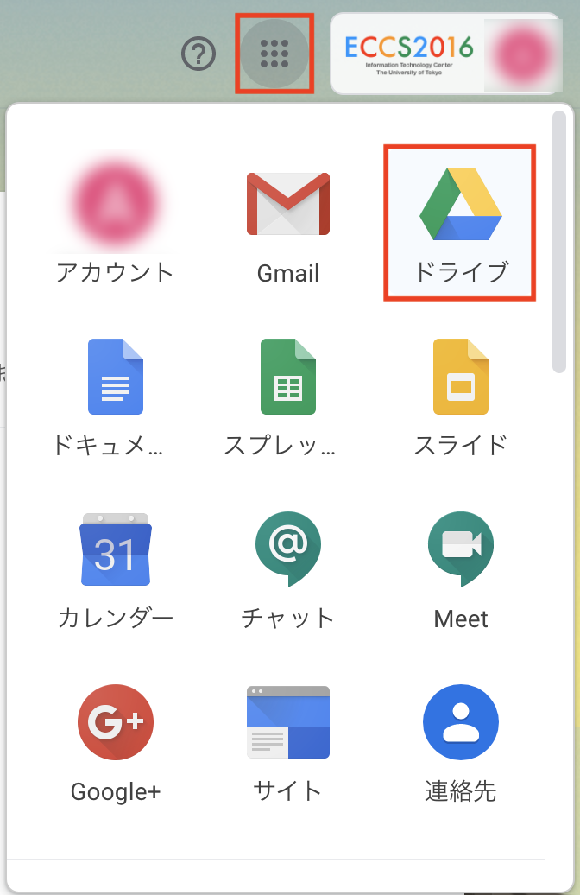
1. マイドライブをクリックし, 公開する動画をアップロードします. アップロードは, 「新規」をクリックした後, 「ファイルのアップロード」から可能です. 
※複数人でファイルを共有している「共有ドライブ」に置いてあるファイルの場合でも, 同様の手順で公開可能です.
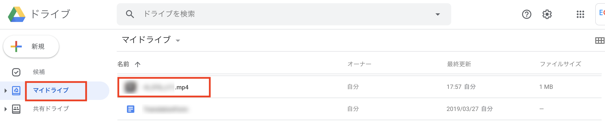
1. 公開する動画を右クリックで選択し, 表示された中から「共有可能なリンクを取得」をクリックします.
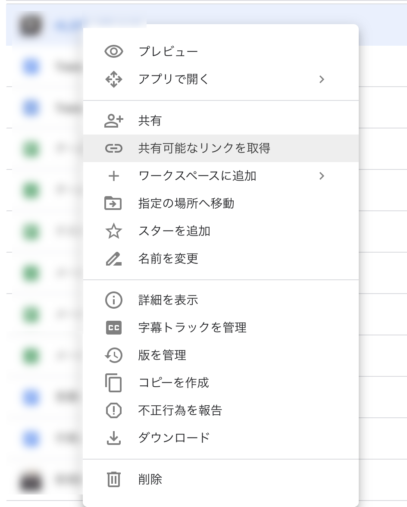
1. 以下の画面が表示されますので, 赤枠で囲った部分をクリックします. 
※以下の画面の「非公開(共有なし)」の部分は, ファイルの共有状態によって異なります.
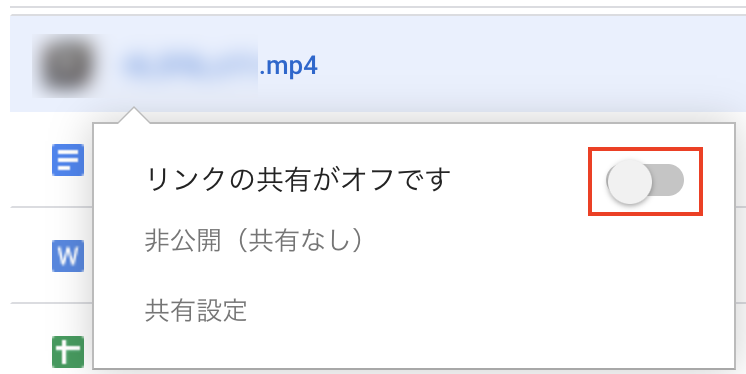
1. 以下の画面のように「リンクの共有がオンです」と表示されることを確認します. 確認後, 「共有設定」をクリックします.
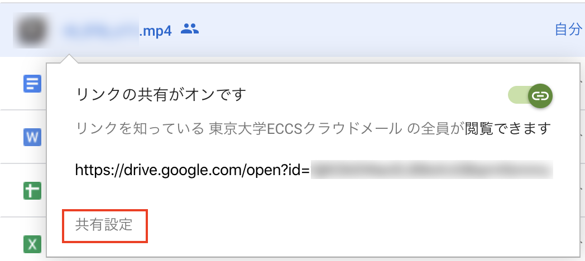
1. 以下の画面が表示されますので, 「リンクをコピー」をクリックします. クリック後, 「完了」を押して画面を閉じます.
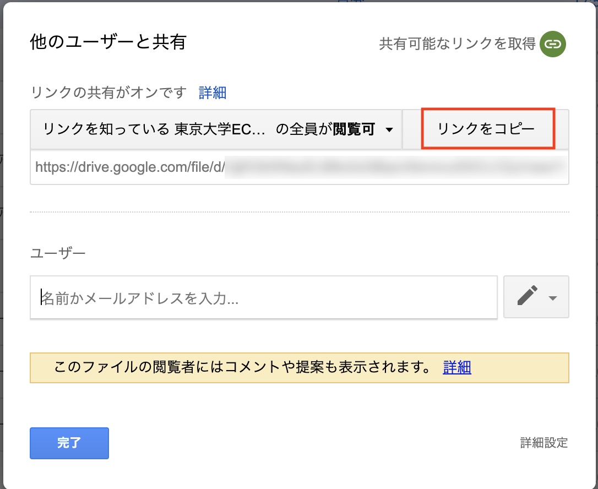
1. UTOLにログインし, 動画を公開するコースを開き, コースTop画面上で教材の「新規追加」の+ボタンをクリックします.

1. 教材内容を登録します. 「教材資料」の項目については, 以下のように入力し, 「追加」ボタンをクリックします. 
タイプ：リンクを選択 
リンク：手順7でコピーしたリンクをペースト
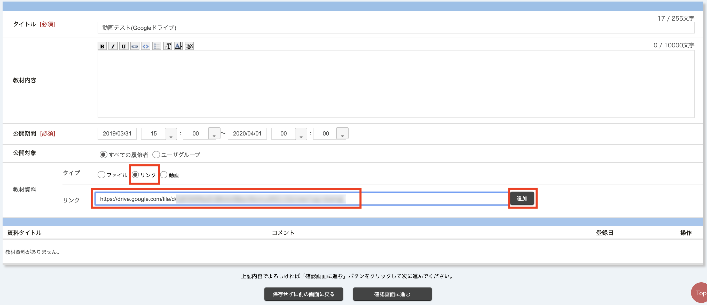
1. 「追加」ボタンをクリックすると, 以下の画像の赤枠のように, 資料の内容が追加されます.
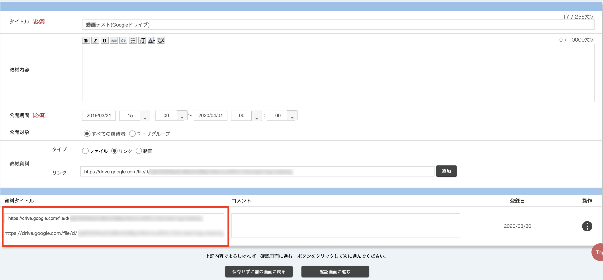
1. デフォルトでは, リンクがそのまま資料タイトルとなるため, 変更したい場合は, 以下の赤枠の部分を任意の名称に変更します. 
その後, 「確認画面に進む」ボタンをクリックします.
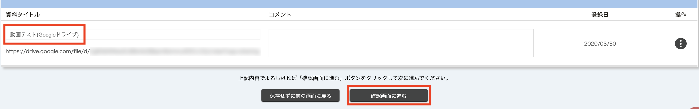
1. 確認画面が表示されますので, 内容に問題なければ「登録する」をクリックします.
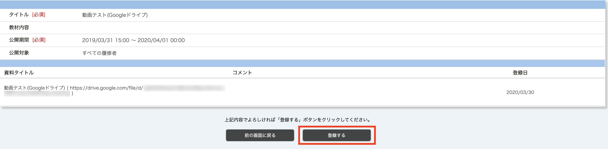
1. 「登録が完了しました」と表示されますので, 「コーストップに戻る」をクリックします.
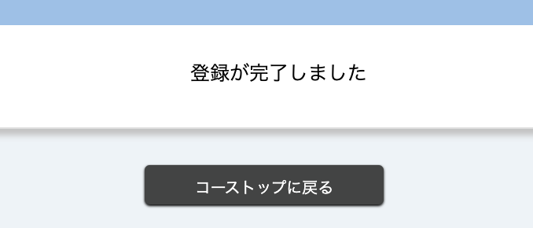
1. コースTop画面上の「教材」メニューに以下のように追加されていることを確認します.
コースTop画面の一番上に「閲覧ページ」ボタンがあり, こちらをクリックすると学生側から見える画面を確認することができます.
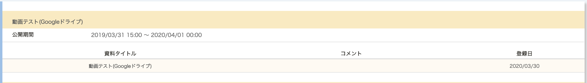

(注意事項)
- Googleドライブに置いた動画は, ECCSクラウドメール持っている学内構成員のみ視聴可能ですが, それより狭い範囲(コースの履修者のみなど)に限定するには, 手順7の「ユーザ」の欄に公開対象全員分ののECCSクラウドメールアドレスを入力してください.
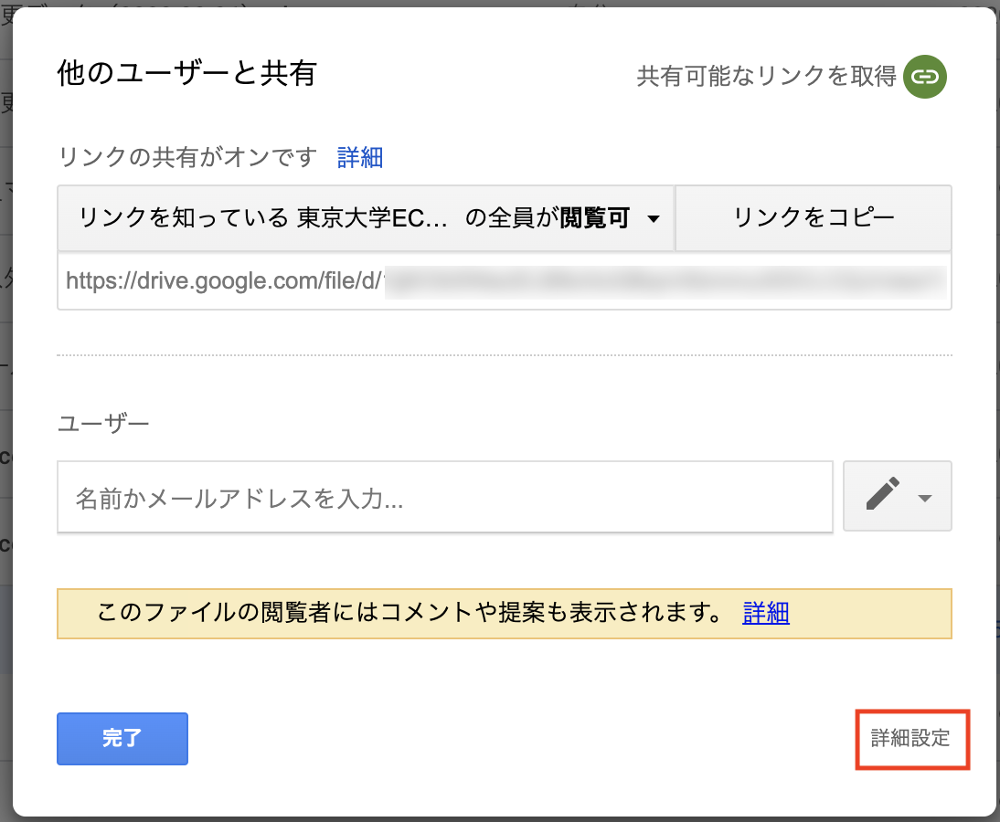
- Googleドライブに置いた動画のダウンロードを禁止するには, 手順7の画面で「詳細設定」をクリックします. 共有の詳細設定画面が表示されますので, 「閲覧者(コメント可)と閲覧者のダウンロード,印刷,コピーを無効にします」にチェックを入れてください.
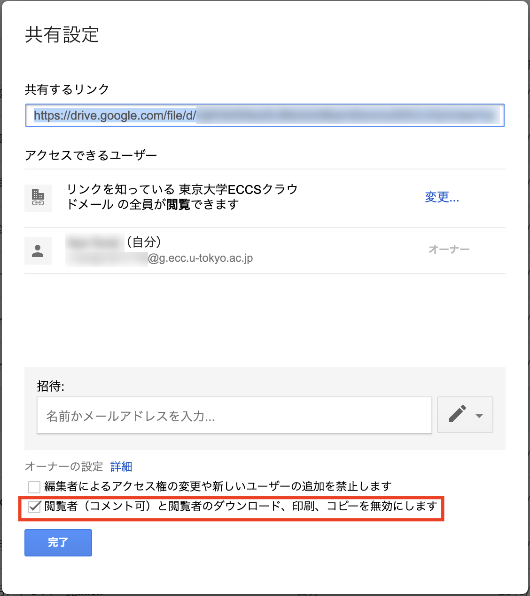

#### Googleドライブで公開する手順
1. Youtubeに限定公開で動画をアップロードします. なお, Youtubeの公開に関するプライバシー設定は, 「公開」, 「非公開」, 「限定公開」とありますが, ここでは「URLを共有可能であるが, 検索結果などに表示されない」限定公開を行うとして説明します. 
Youtubeのプライバシー設定については, [こちら](https://support.google.com/youtube/answer/157177?co=GENIE.Platform%3DAndroid&hl=ja)をご覧ください.
1. UTOLにログインし, 動画を公開するコースを開き, コースTop画面上で教材の「新規追加」の+ボタンをクリックします.

1. 教材内容を登録します. 「教材資料」の項目については, 以下のように入力し, 「追加」ボタンをクリックします. 
タイプ：動画を選択 
リンク：公開しているYoutubeの動画のリンクをペースト
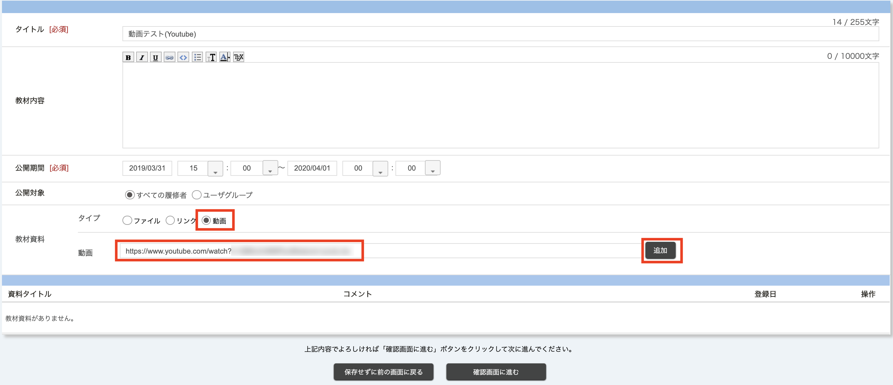
1. 「追加」ボタンをクリックすると, 以下の画像の赤枠のように, 資料の内容が追加されます.
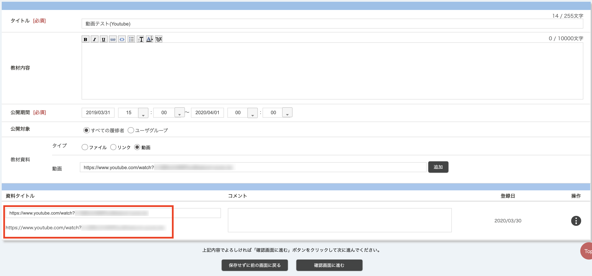
1. デフォルトでは, リンクがそのまま資料タイトルとなるため, 変更したい場合は, 以下の赤枠の部分を任意の名称に変更します. 
その後, 「確認画面に進む」ボタンをクリックします.
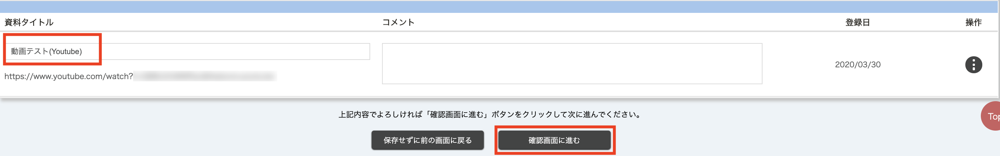
1. 確認画面が表示されますので, 内容に問題なければ「登録する」をクリックします.
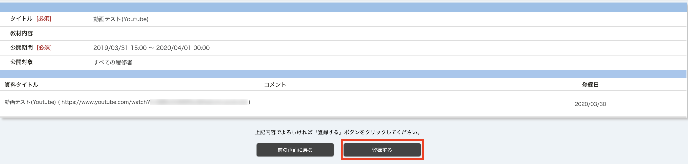
1. 「登録が完了しました」と表示されますので, 「コーストップに戻る」をクリックします.
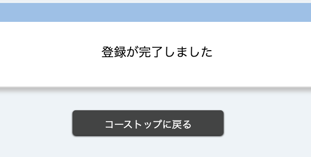
1. コースTop画面上の「教材」メニューに以下のように追加されていることを確認します.
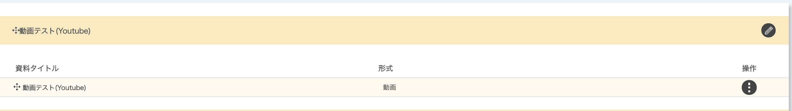
1. コースTop画面の一番上に「閲覧ページ」ボタンがあり, こちらをクリックすると学生側から見える画面を確認することができます. Youtubeの場合は, 以下の画像のように動画が埋め込まれています.
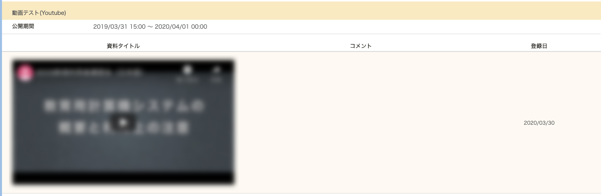

(注意事項)
- 限定公開の場合, 履修者側で見える「埋め込まれている動画」をUTOL上で再生しようとすると, 「動画を再生できません.この動画はYoutubeでご覧ください.」というメッセージが表示される場合があります.Youtubeでは正常に視聴できることを確認していますので, 上記のメッセージが出た場合は, Youtubeで視聴するようご周知ください.
- Youtubeの限定公開では, 検索結果やおすすめに表示されることはありませんが, URLを知っていれば学外の方誰でも見ることができますので, その点ご留意ください.

### Q. 期限として設定できる時間を1分単位で指定したい [教職員]
UTOLの時刻設定部分では,5分刻みで指定できるようにプルダウン表示をしています.
また,時刻入力部分に直接時刻指定をすることで,1分刻みの指定も可能となっています.

### Q. 公開されている教材の公開期間を変更できますか [教職員]
教材の公開期間については,以下のとおり変更可能です.

- 教材作成時に,公開期間の設定は可能
- 教材公開後に,公開期間 (開始-終了日時) の変更が可能
- 教材公開期間終了後でも,公開期間 (開始-終了日時) の変更が可能

### Q. フィードバックファイルの一括登録に失敗するため，解決方法を知りたい [教職員]
課題機能において学生が提出した成果物に対して,履修者へのコメントと評価,またフィードバックファイルをZipファイルに圧縮する形で一括登録することができます.

ただし,このアップロードできるZipファイルの容量は100MBに制限されており,100MB以上のZipファイルをアップロードした際には,システムエラーが発生します.

#### 容量が大きい場合のアップロード手順
システムから出力されるExcelファイルでは,コースに登録されているすべての学生の情報が行単位で記載されています. 
圧縮後のZipファイルのサイズが100MB以上となってしまう場合は,コースに登録されている学生を複数回に分ける形で登録を行ってください. 
具体的には,まずExcelファイル内の不要な学生の対象行を削除し,次に残す学生に対応するフィードバックファイルを配置する形でZipファイルを作成し,システムにアップロードを行ってください.

### Q. 作成したテストが学生からどのように見えるか事前に確認したい [教職員]
テスト作成時に,「受験シミュレーション」機能で確認することができます.詳しくは,教員向けマニュアルの「XXXX」をご参照ください

### Q. テストおよびアンケートで作成したテンプレートを他のコースでも使いたい [教職員]
UTOL のテストおよびアンケートのテンプレートは,テンプレートを作成したアカウントに紐付くかたちで登録・管理されます.
自分で作成したテンプレートは,自分が担当教員またはTAとなっている他のコースでも使用できます.

#### 担当教員が複数登録されているコースの場合
自分が作成したテンプレートに加え,他の担当教員がそのコースで作成したテンプレートを使用できます.

自分がそのコースに登録される以前に他の担当教員が作成したテンプレートは,使用できません.
他の担当教員が作成したテンプレートを別のコースで使用したい場合は,テンプレートの引継ぎを行う必要があります．詳しくは,教員向けマニュアルの「XXXX」をご参照ください．

### Q. 複数の穴埋め問題を設定したテストを作成したい [教職員]
複数の穴埋めを用意した問題を作成することは可能ですが,以下の点についてご注意下さい.

- 穴埋め箇所は,文章中の任意の場所に設定できます.（1問につき最大100 箇所まで）
- 正解箇所ごとに任意の得点を設定することはできません
- 自動採点の方式は,以下の3通りから選択できます.
  - 正解(完全一致)の穴の数に応じて配点
  - 不正解(完全一致しない)の穴があれば0点
  - 不正解(完全一致しない)の穴があれば未採点

### Q. テストの各設問について出題時に配点を表示させたい [教職員]
テストの登録画面では,設問毎に配点を設定することができますが,設定した配点を出題時に表示する機能はありません. お手数ですが,設問内に配点を記載して頂くことでご対応ください.

### Q. テストの解答期間（解答開始時刻・終了時刻）を後から変更したい [教職員]
現在公開しているテストの解答期間中であれば,解答期間の終了日時の変更は可能です.テスト解答期間の変更については,以下をご覧下さい.

- テスト作成時に解答期間の設定は可能
- テスト公開前であれば,解答期間の変更は可能
- テスト公開後は,解答期間中であれば,解答期間の終了日時の変更は可能
- テスト解答期間終了後は,解答期間の変更は不可

### Q. 掲示板の公開期間を後から変更したい [教職員]
掲示板の公開期間については,以下のとおり変更可能です.

- 掲示板作成時に,投稿期間の設定は可能
- 掲示板公開後に投稿期間 (開始-終了日時) の変更が可能
- 掲示板投稿期間終了後でも,投稿期間 (開始-終了日時) の変更が可能

### Q. アンケートの回答期間を後から変更したい [教職員]
現在公開しているアンケートの回答 (公開) 期間中であれば,回答期間の終了日時の変更は可能です.アンケート回答期限の変更については以下をご覧下さい.

- アンケート作成時に,回答期間の設定は可能
- アンケート公開前であれば,回答期間の変更は可能
- アンケート公開後は,回答期間中であれば,回答期間の終了日時の変更は可能
- アンケート回答期間終了後は,回答期間の変更は不可

### Q. 無記名式のアンケートは作成できますか [教職員]
アンケート作成時に，「記名・無記名」の項目を＜無記名＞に選択していただくことで作成可能です．
詳しくは,教員向けマニュアルの「XXXX」をご参照ください．

### Q. 無記名式のアンケートは作成できますか [教職員]
アンケート機能から無記名式のアンケートを作成可能です．詳しくは,教員向けマニュアルの「XXXX」をご参照ください．

### Q. 公開済みのお知らせの掲示期間を後から変更したい [教職員]
現在公開しているお知らせの掲示期間終了日時を変更することは可能です.お知らせの掲示期間変更については,以下をご覧下さい.

  - お知らせ作成時に,掲示期間の設定は可能
  - お知らせ公開前であれば,掲示期間の変更が可能
  - お知らせ公開後は,掲示期間中であれば,掲示期間の終了日時の変更は可能
  - お知らせ掲示期間終了後は,掲示期間の変更は不可

## 出席管理
### Q. 出席を登録したいが「出席送信」ボタンが表示されない [学生]
「出席送信」ボタンは,教員が指定した時間 (「出席」として扱う時間) 内のみ表示されます.そのため,「出席」として認められない時間になると,「出席送信」ボタンは表示されません.

「出席送信」ボタンが表示されている時間中であれば,何回でもクリックする,コメントを記載することは可能です. ただし,「出席送信」可能な時間を超過すると,「出席送信可能な時間を過ぎました.」と表示され,エラー (送信不可) となります.

### Q. 「出席送信」時のワンタイムパスワードがわからない [学生]
担当教員にご確認ください.

### Q. 授業後にまとめて出席を登録することはできますか [教職員]
一行に一つずつ出席者のユーザIDを記載したCSVまたはTXTファイルを登録する事で出席管理できます.

ファイルのファイルフォーマット（ユーザID（共通ID10桁））
  - 9999999999
  - 8888888888

詳しくは,教員向けマニュアルの「XXXX」をご参照ください．

### Q. 学生証をカードリーダで読み取り，出席データを登録することはできますか [教職員]
ICカードリーダを使って学生証を読み取り,出席データをUTOLに取り込むことができます. 
なお,ICカードリーダ本体は情報基盤センター窓口にて貸し出しが可能です.持参PCでカードリーダをご利用いただく場合は読み取り用プログラムをお渡ししますので,事前に[サポート窓口](/support/index.md)からお問い合わせください.  
※読み取りプログラムについてはWindows10で動作確認済みです. 
※出席管理用途以外で利用される場合は,提供いたしません.

#### ICカードリーダ利用手順
カードの読み取り ICカードリーダをPCに接続して認識が完了するのを待ちます. 
読み取りプログラムを起動します.（場所はC:\Program Files (x86)\U-Tokyo\ICCC\ICCC.exe） 
"ICカード読み取り"をクリックします.

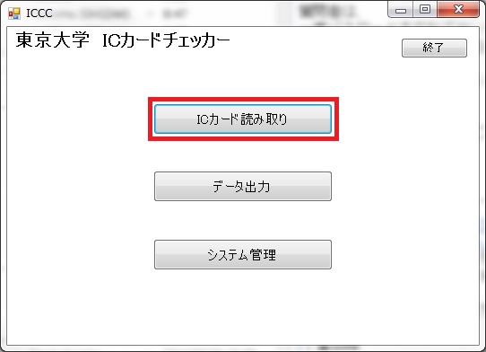

時間割番号の入力を求められますが,ここでは何も入力せずOKを押します. 
起動した別ウインドウの"読取開始"を押すと読み取り可能な状態になり,学生証をカードリーダにかざすと情報を読み取ります.

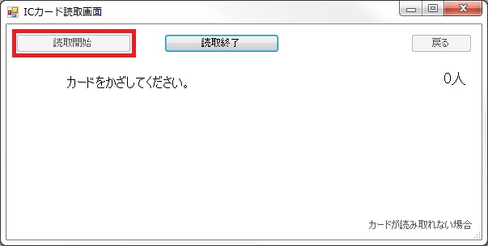

必要な人数の読み取りが終わったら"読取終了"->"戻る"とクリックします.

読み取ったデータの出力 "データ出力"をクリックします. 
起動した別ウインドウで出力するファイルにチェックを入れて"出力"をクリックします. 
ファイル保存ダイアログでファイル名を付けて保存するとzipファイルが作成されます. 
zipファイルを解凍すると出席情報が記載されたcsvファイルが得られます. 
出席した学生を一括登録する UTOLにログインし,当該授業のTOPへ移動します. 
左メニュー"コースコンテンツ"->"出席管理"より授業を登録します. 
出席管理一覧に登録した授業が出ていることを確認し,横の[操作]ボタンの中の[出席登録]をクリックします.

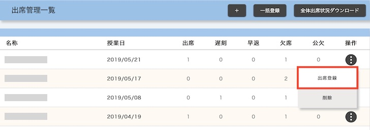

出席登録画面の「出席者一括登録」欄にある"参照"ボタンをクリックし,先の手順で得たcsvファイルを指定してアップロードします.（text形式でも登録可能です.）

※一括登録時にエラーが出る場合はcsvファイルの第一カラムが正しいユーザIDになっていることを確認し,必要に応じてファイルを修正してください.
※学生の場合,ユーザIDは10桁の数字になります.
先頭に0が挿入された16桁になっている,等の場合は不要な0を除去してからアップロードしてください.

出席状況が変化したことを確認して"確認画面に進む"->"登録する"とクリックしてください.

※出席以外の状況（早退など）もまとめて登録したい場合は,出席者一括登録ではなく「出席データ一括アップロード」機能をご利用ください.
出席登録画面にある記入用フォーマット（エクセル形式）をダウンロードして編集後,「出席者一括登録」欄にある"参照"ボタンをクリックし,ファイルを指定してアップロードすることで一括登録が可能です.ただしカードリーダからのエクセル出力は対応しておりません.（各自フォーマットファイルをダウンロードして編集してください）

以上が大まかな一括登録の流れとなります．
詳しくは,教員向けマニュアルの「XXXX」をご参照ください．